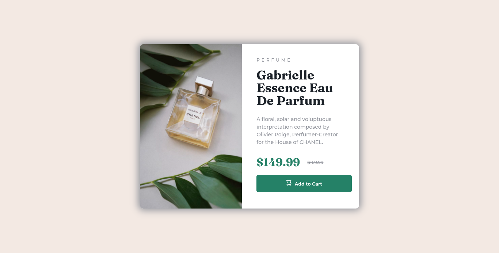
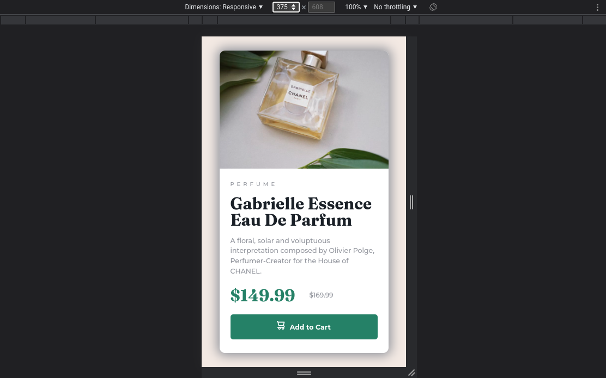

# Frontend Mentor - Product preview card component solution

This is a solution to the [Product preview card component challenge on Frontend Mentor](https://www.frontendmentor.io/challenges/product-preview-card-component-GO7UmttRfa).

## Table of contents

- [Overview](#overview)
  - [Screenshot](#screenshot)
  - [Links](#links)
- [My process](#my-process)
  - [Built with](#built-with)
  - [What I learned](#what-i-learned)
  - [Useful resources](#useful-resources)
- [Author](#author)
- [Acknowledgments](#acknowledgments)

## Overview

### Screenshot

#### Desktop



#### Mobile



### Links

- Solution URL: [Github](https://github.com/kent5205/Product-Preview-Card-)
- Live Site URL: [Vercel](https://product-preview-card-4dzz.vercel.app/)

## My process

### Built with

- Semantic HTML5 markup
- CSS custom properties
- Flexbox
- Mobile-first workflow
- Media Queries

### What I learned

This challenge helps me understand more about flexbox, media queries, hover state and many more. Though this is not not perfectly pixelated because I have a smaller screen. Still a fun challenge.

Also I learn about picture tag(it changes picture based on the screen size) and the line-through decoration(it puts a line through the word).

#### Picture tag that I recently learn

```html
<picture>
  <source
    media="(min-width:768px)"
    srcset="./images/image-product-desktop.jpg"
  />
  
</picture>
```

#### My full CSS Code

```css
@import url("https://fonts.googleapis.com/css2?family=Montserrat:wght@500;700&display=swap");
@import url("https://fonts.googleapis.com/css2?family=Fraunces:opsz,wght@9..144,700&display=swap");

/*--- Reset default values ---*/
*,
*::before,
*::after {
  box-sizing: border-box;
}

body,
h1,
h2,
h3,
h4,
p,
li,
figure,
figcaption,
blockquote,
dl,
dd {
  margin: 0;
}

html:focus-within {
  scroll-behavior: smooth;
}

img {
  max-width: 100%;
  display: inline-block;
}

/*--- Variables used ---*/

:root {
  --primary-color: hsl(222, 5%, 59%);
  --secondary-color: hsl(215, 18%, 13%);
  --price-cart-color: hsl(157, 36%, 37%);
  --body-bg-color: hsl(24, 38%, 92%);
  --main-bg-color: hsl(0, 0%, 100%);
  --stylistic-font: "Fraunces", serif;
  --cart-hover-color: hsl(163, 44%, 14%);
}

/*---Global Styling---*/
button {
  font: inherit;
  font-weight: 700;
  font-size: 0.7813rem;
  width: 100%;
  padding-block: 0.7813rem;
  background-color: var(--price-cart-color);
  border: none;
  border-radius: 0.3125rem;
  color: var(--main-bg-color);
  transition: all 0.5s ease;
}

body {
  min-height: 100vh;
  color: var(--primary-color);
  line-height: 1.5;
  text-rendering: optimizeSpeed;
  font-family: "Montserrat", sans-serif;
  font-size: 0.875rem;
  background-color: var(--body-bg-color);
  display: flex;
  align-items: center;
  justify-content: center;
}

main {
  width: 19.375rem;
  background-color: var(--main-bg-color);
  border-radius: 0.625rem;
  box-shadow: 0rem 0rem 1.25rem 0.3125rem var(--primary-color);
}

h1 {
  text-transform: uppercase;
  font-size: 0.625rem;
  font-weight: 500;
  letter-spacing: 0.3125rem;
}

p {
  font-size: 0.7813rem;
}

h2 {
  color: var(--secondary-color);
  font-family: var(--stylistic-font);
  font-weight: 700;
  font-size: 1.875rem;
  line-height: 1;
  padding-block: 0.875rem;
}

/*--- Class Styling ---*/

.price-container {
  display: flex;
  justify-content: space-between;
  align-items: center;
  width: 70%;
  margin-block: 0.75rem;
}

.original-price {
  font-size: 0.75rem;
  text-decoration: line-through;
  margin-left: 1.25rem;
}

.sale-price {
  font-family: var(--stylistic-font);
  font-size: 1.875rem;
  color: var(--price-cart-color);
}

.cart {
  margin-right: 0.3125rem;
}

.product-image img {
  border-radius: 0.625rem 0.625rem 0 0;
}

.product-details {
  margin: 0.9375rem 1.25rem 1.5625rem 1.25rem;
}

/*--- Desktop Responsiveness ---*/

@media only screen and (min-width: 48rem) {
  main {
    display: flex;
    width: 37.5rem;
  }
  .product-image img {
    border-radius: 0.625rem 0 0 0.625rem;
    height: 100%;
    width: 18.75rem;
  }

  .product-details {
    padding: 1.25rem 0rem 1.25rem 1.25rem;
    width: 18.75rem;
  }

  h1 {
    font-size: 0.75rem;
  }

  h2 {
    font-size: 2.1875rem;
  }

  p {
    font-size: 0.875rem;
    padding: 0.625rem 1.5625rem 0.625rem 0;
  }
}

/*--- Hover State ---*/

button:hover {
  transform: scale(1.025);
  background-color: var(--cart-hover-color);
  cursor: pointer;
}
```

### Useful resources

- [W3School](https://www.w3schools.com/w3css/defaulT.asp) - This is my reference when I tend to forget some CSS properties.

- [A Modern CSS Reset](https://piccalil.li/blog/a-modern-css-reset/) - This helps me in resetting default CSS properties.

## Author

- Frontend Mentor - [@kent5205](https://www.frontendmentor.io/profile/kent5205)

## Acknowledgments

I personally wanted to thank [@correlucas](https://www.frontendmentor.io/profile/correlucas), [@vanzasetia](https://www.frontendmentor.io/profile/vanzasetia) and [@vcarames](https://www.frontendmentor.io/profile/vcarames) for their suggestions in my code and [Frontend Mentor](https://www.frontendmentor.io/) for this wonderful opportunity for me to learn in an enjoyable way. 🖤
